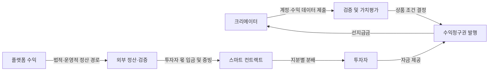

# 크리에이터 수익 브릿지

> 크리에이터가 앞으로 받을 플랫폼 수익을 미래 현금흐름 RWA로 구조화하고, 필요한 자금을 미리 확보할 수 있도록 하는 선지급 서비스

현재 프로젝트는 구현을 시작하기 전 설계 단계다. 이 문서에서 말하는 발견과 주장은 확정된 결론이 아니라 프로젝트를 통해 검증할 가설이다.

## 프로젝트 개요

유튜버, 스트리머, 음악가, 웹툰 작가처럼 플랫폼에서 반복적인 수익을 얻는 크리에이터는 수익이 발생해도 실제 정산까지 기다려야 한다. 향후 수익이 예상되더라도 기존 금융에서는 불규칙한 플랫폼 수익을 담보나 신용으로 평가하기 어렵기 때문에 제작비와 운영자금을 제때 확보하기 어렵다.

크리에이터 수익 브릿지는 과거 수익과 활동 데이터를 바탕으로 미래 현금흐름을 평가하고, 일정 기간 동안 발생할 수익의 일부에 대한 청구권을 구조화한다. 투자자가 이 수익권에 자금을 제공하면 크리에이터는 선지급금을 받고, 이후 실제 플랫폼 수익이 발생할 때 약정된 비율에 따라 투자자에게 분배한다.

예를 들어 최근 12개월 동안 일정한 광고 수익을 낸 유튜버가 향후 12개월 광고 수익의 20%에 대한 권리를 발행하고, 그 대가를 현재의 제작비로 먼저 받는 구조를 생각할 수 있다.

## 대상 사용자

- 유튜버, 스트리머, 음악가, 웹툰 작가 등 반복적인 플랫폼 수익이 발생하는 크리에이터
- 크리에이터의 미래 수익에 자금을 제공하고 실제 성과에 따른 분배를 받고자 하는 투자자
- 수익 데이터를 검증하고 수익청구권의 계약과 정산을 운영하는 발행·검증 주체

## 핵심 사용 흐름

1. 크리에이터가 플랫폼 계정을 연동하고 과거 수익 및 활동 데이터를 제출한다.
2. 플랫폼 데이터와 위험 요인을 바탕으로 예상 미래 수익과 현재 가치를 산정한다.
3. 향후 일정 기간 동안 발생하는 적격 수익의 일부에 대한 수익청구권을 구성한다.
4. 투자자가 수익권을 취득하면 크리에이터가 선지급금을 받는다.
5. 플랫폼에서 실제 수익이 발생하면 외부 정산·검증 주체가 이를 확인하고 투자자 몫을 온체인에 입금한다.
6. 스마트 컨트랙트가 실제 입금액과 수익권 보유 지분에 따라 투자자의 청구 가능 금액을 계산하고 지급한다.



## 다루는 RWA

이 프로젝트가 다루는 기초 자산은 유튜브 광고 수익, 음원 로열티, 스트리밍 수익 등 앞으로 발생할 플랫폼 수익이다. 아직 존재하지 않는 현금을 그대로 토큰화하는 것이 아니라, 해당 현금이 발생했을 때 일정 비율을 받을 수 있도록 계약으로 정한 수익청구권을 온체인에 표현한다.

| 구분 | 내용 |
| --- | --- |
| 오프체인 자산 | 향후 플랫폼 수익과 그 수익에 대한 법적 청구권 |
| 검증 자료 | 플랫폼 정산 내역, 과거 수익, 조회수·활동 추세, 계정 소유 증명 |
| 가치평가 자료 | 예상 수익, 변동성, 할인율, 크리에이터·플랫폼 위험 |
| 온체인 표현 | 특정 기간과 조건을 가진 수익권의 발행량·보유 지분·정산 상태 |
| 온체인 자금 | 투자자가 예치한 취득 대금과 외부 정산 주체가 입금한 투자자 몫 |

원문 계약, 플랫폼 API 토큰, 정산 내역 원본과 개인정보는 온체인에 저장하지 않는다. 컨트랙트에는 외부 문서와 평가 결과를 참조하기 위한 해시와 정산에 필요한 최소 상태만 기록한다. 문서 해시는 자료의 변경 여부를 비교할 수 있게 하지만 자료의 진실성이나 법적 효력을 스스로 증명하지는 않는다.

## 왜 블록체인을 사용하는가

- 수익청구권을 표준화된 토큰으로 표현해 발행량, 보유 지분과 이전 내역을 일관된 규칙으로 기록할 수 있다.
- 모집, 환불, 수익 입금과 투자자별 청구를 스마트 컨트랙트의 공개된 규칙으로 처리할 수 있다.
- 실제 입금액보다 많은 금액을 지급하거나 같은 수익을 중복 청구하는 동작을 코드 수준에서 제한할 수 있다.
- 향후 법적·운영적 조건이 갖춰지면 담보, 거래, 대출 등 다른 온체인 금융 서비스와 결합할 가능성이 있다.

블록체인은 미래 수익을 예측하거나 플랫폼에서 정산금을 강제로 가져오지 못한다. 토큰 발행만으로 법적 청구권이 생기지도 않는다. 따라서 프로젝트의 핵심은 온체인 기록과 오프체인 검증·계약·정산 경로가 어떻게 연결되는지를 명확히 만드는 데 있다.

구체적인 컨트랙트 구성, 권한, 상태 전이, 배분 공식과 테스트 계획은 [컨트랙트 설계 문서](contracts/README.md)에서 다룬다.

## 프로젝트에서 검증할 핵심 문제

### Verification — 검증

지난달 수익은 정산 내역으로 확인할 수 있지만 다음 달 수익은 아직 존재하지 않는다. 미래 현금흐름의 실재성 검증은 자산 보유 여부를 확인하는 방식보다 신용평가에 가깝다.

검증 후보 데이터는 다음과 같다.

- 과거 수익과 수익 변동성
- 조회수, 구독자와 활동 추세
- 플랫폼별 정산 데이터와 광고 단가 변화
- 크리에이터의 활동 중단 가능성
- 계정 정지와 플랫폼 정책 변경 위험

프로젝트에서는 검증된 결과와 증빙 해시를 온체인에 남길 수 있지만, 데이터를 제공하는 주체의 진실성까지 컨트랙트만으로 보장할 수 있는지를 확인한다.

### Valuation — 가치평가

미래 예상 수익은 시간가치와 여러 위험을 반영해 현재 가치로 환산해야 한다.

```text
미래 예상 수익
- 시간가치
- 수익 변동 위험
- 크리에이터 위험
- 플랫폼 위험
= 현재 가치
```

수익권 토큰을 발행하는 기술과 적정 모집 가격을 산정하는 일은 서로 다른 문제다. 평가 모델은 백엔드와 오프체인 분석의 책임이며, 컨트랙트는 모집 전에 결정된 가격·기간·분배 비율이 이후 임의로 바뀌지 않도록 기록한다.

### Enforcement — 집행

실제 플랫폼 수익이 발생했을 때 투자자 몫이 약속된 경로로 전달되어야 한다. 컨트랙트는 자금이 온체인에 입금된 이후의 분배 규칙을 강제할 수 있지만, 플랫폼 계좌에서 컨트랙트까지 이어지는 흐름은 법적 계약과 정산계좌 통제에 의존한다.

```text
플랫폼 수익 발생
→ 지정 정산계좌 수령
→ 적격 수익 검증
→ 약정 비율 분리
→ 투자자 몫 온체인 입금
→ 수익권 지분별 청구
```

이 연결이 없다면 투자자는 결국 크리에이터나 운영 주체가 돈을 입금할 것이라고 믿어야 한다. 프로젝트에서는 입금 전과 입금 후의 집행 범위를 분리해 표현하고, 기술로 보장되는 부분과 외부 신뢰에 남는 부분을 함께 기록한다.

## MVP 상품 가정

구현 가능한 첫 범위를 정하기 위해 다음 조건을 초기 가정으로 둔다. 팀 검토 후 변경할 수 있으며, 조건이 달라지면 컨트랙트의 상태와 배분식도 함께 수정해야 한다.

| 항목 | 초기 제안 |
| --- | --- |
| 상품 단위 | 한 크리에이터의 특정 플랫폼·계정·수익 기간에 대한 수익권 한 건 |
| 투자자 권리 | 기간 내 실제 적격 수익의 일정 비율을 보유 지분에 따라 수령 |
| 투자금의 의미 | 수익권 취득 대금이며 확정 이자나 별도 원금 반환 약정 없음 |
| 모집 방식 | 고정 단가·고정 수량의 목표액 전액 모집 |
| 모집 실패 | 마감 시 미달이면 투자자가 납입금 전액 환불 청구 |
| 모집 성공 | 목표액 충족 후 크리에이터가 선지급금 수령 |
| 수익권 전송 | 초기에는 투자자 간 전송 제한 |
| 분배 방식 | 실제 입금된 투자자 몫을 각 투자자가 직접 청구 |
| 수익 상한 | 초기에는 별도 상한 없음. 실제 성과에 따라 원금보다 적거나 많을 수 있음 |
| 정산 자산 | 배포 시 고정하는 단일 ERC-20 |
| 네트워크 | 로컬 Anvil과 Base Sepolia 우선 검토 |

## 기대하는 발견과 연구 연결

프로젝트를 시작할 때의 질문은 “미래 수익을 토큰화하면 자산으로 사용할 수 있는가?”이다. 구현 과정에서는 다음 발견 후보를 검증한다.

| 검증할 가설 | 프로젝트에서 남길 증거 | 해석의 한계 |
| --- | --- | --- |
| 검증 주체의 진실성을 컨트랙트만으로 보장하기 어려움 | 같은 온체인 구조에 서로 다른 외부 수익 보고를 적용한 사례 | 조작 가능성이 실제 조작 발생을 의미하지는 않음 |
| 가격 평가는 토큰 발행과 별개의 문제 | 동일한 수익권에 다른 예상 수익·할인 가정을 적용한 비교 | 시뮬레이션 가격이 실제 시장 가격을 증명하지 않음 |
| 입금 이후 분배는 코드로 제약 가능 | 중복 청구·재진입·지급 한도·회계 불변조건 테스트 | 테스트 통과가 모든 결함의 부재를 증명하지 않음 |
| 입금 이전 수익 확보는 외부 집행에 의존 | 보고 또는 입금 중단 시 미정산 상태가 남는 시나리오 | 데모의 정산 주체가 실제 법적 집행을 대체하지 않음 |

이 과정을 바탕으로 다음 흐름을 만든다.

- 프로젝트: **크리에이터 수익 브릿지**
- 프로젝트 진행보고서: **크리에이터 수익 브릿지 — 미래 플랫폼 수익을 활용한 RWA 기반 선지급 서비스**
- 리서치 질문: **미래 현금흐름은 어떻게 RWA가 될 수 있는가?**
- 아티클: **아직 벌지 않은 돈도 자산이 될 수 있을까 — 미래 현금흐름의 RWA화**
- 핵심 주장 후보: **미래 현금흐름을 RWA로 만드는 핵심은 토큰화가 아니라, 그 현금흐름을 검증 가능하고 집행 가능한 권리로 만드는 것이다.**

핵심 주장은 개발 전의 결론이 아니다. 진행보고서에는 설계 가정, 실험 방법, 결과와 해결되지 않은 문제를 구분해 기록하고, 구현과 테스트에서 얻은 근거에 따라 주장을 수정한다.

## 확장 가능성

크리에이터 플랫폼 수익에서 시작하지만 같은 구조는 매출채권, 음원 로열티, 구독 매출, 임대 수익, 태양광 발전 수익과 같은 미래 현금흐름으로 확장할 수 있다. 확장 시에는 자산별 검증 데이터, 법적 청구권, 정산 주기와 채무불이행 처리 방식이 달라진다.

## 주요 위험과 제약

- 크리에이터 성과 하락, 활동 중단, 계정 정지와 플랫폼 정책 변경
- 미래 수익 예측 오류와 할인율 산정의 주관성
- 같은 미래 수익의 중복 양도 또는 과도한 권리 설정
- 외부 검증 주체와 정산 운영자에 대한 신뢰
- 정정 정산, 차지백, 환전, 세금과 수수료 처리
- 투자계약증권 등 증권성, 투자자 자격, KYC/AML와 관할 법률 검토
- 스마트 컨트랙트 오류, 관리자 키와 결제 토큰 위험

실제 서비스에서는 법적 청구권이 토큰 보유자에게 연결되도록 계약·수탁·정산계좌 구조를 갖춰야 한다. 현재 프로젝트는 이 문제를 해결했다고 가정하지 않고 기술적 데모와 연구 범위를 구분한다.

## 저장소 구성

```text
creator-revenue-bridge/
├── frontend/   # 사용자 화면과 지갑 연결
├── backend/    # 플랫폼 데이터, 평가, API와 체인 이벤트 처리
├── contracts/  # 수익권, 모집, 정산과 분배 규칙
└── docs/       # 개발 이슈, 보안 검증, 법률·리서치 기록
```

- `frontend`: Next.js App Router + TypeScript
- `backend`: Spring Boot + Java 21 + Gradle
- `contracts`: Solidity + Foundry, Ethereum L2 배포 대상

구현 과정에서 확인한 문제와 검증 기록은 [개발 기록](docs/README.md)에서 관리한다.

## 개발 환경 실행

### Docker Compose

Docker가 설치되어 있으면 Node.js, Java와 Foundry를 호스트에 각각 설치하지 않고 전체 개발 환경을 실행할 수 있다. 처음 저장소를 받은 뒤 컨트랙트 의존성을 초기화하고 개발용 Compose를 실행한다.

```bash
git submodule update --init --recursive
docker compose -f compose.dev.yaml up --build
```

개발 환경은 다음 주소를 사용한다.

| 서비스 | 주소 | 용도 |
| --- | --- | --- |
| Frontend | `http://localhost:3000` | Next.js 개발 서버와 소스 변경 반영 |
| Backend | `http://localhost:8080` | Spring Boot 개발 서버 |
| Anvil RPC | `http://localhost:8545` | 체인 ID `31337`인 로컬 Ethereum RPC |

`forge` 서비스는 Anvil이 준비된 뒤 컨트랙트 테스트를 한 번 실행한다. 테스트나 Foundry 명령을 다시 실행하려면 다음 명령을 사용한다.

```bash
docker compose -f compose.dev.yaml run --rm forge test
docker compose -f compose.dev.yaml run --rm --entrypoint cast forge block-number --rpc-url http://anvil:8545
```

로컬 컨트랙트를 Anvil에 배포하고 관리자 역할, 투자자 허용 목록과 모의 정산 토큰 잔액을 초기화하려면 다음 명령을 사용한다.

```bash
docker compose -f compose.dev.yaml up -d anvil
docker compose -f compose.dev.yaml run --rm forge \
  script script/DeployLocal.s.sol:DeployLocal \
  --rpc-url http://anvil:8545 \
  --broadcast
```

배포 스크립트는 체인 ID `31337`에서만 실행된다. 기본값은 Anvil 개발 계정 1번을 관리자, 2번을 발행자, 3번을 정산자, 4번을 투자자로 구성하고 투자자에게 1,000,000 mUSD를 지급한다. 배포가 끝나면 모의 정산 토큰, Bridge와 수익권 토큰 주소가 출력된다. `.env`에서 `ANVIL_DEPLOYER_PRIVATE_KEY`, 역할별 주소, 지급액과 `LOCAL_TOKEN_BASE_URI`를 변경할 수 있다. 이 계정들은 공개된 테스트 전용 자격 증명이므로 실제 자산이나 외부 네트워크에 사용하지 않는다.

컨테이너와 개발용 볼륨을 함께 정리하려면 다음 명령을 사용한다.

```bash
docker compose -f compose.dev.yaml down --volumes
```

운영용 Compose는 소스 마운트와 로컬 체인을 포함하지 않고 빌드된 Frontend·Backend 런타임만 실행한다. `.env.example`을 복사해 실제 RPC 주소 등 운영 환경 값을 설정한 뒤 실행한다.

```bash
cp .env.example .env
docker compose -f compose.prod.yaml up --build -d
```

`NEXT_PUBLIC_API_URL`은 Frontend 이미지 빌드 시 브라우저가 접근할 Backend 주소로 포함된다. 운영 환경에서는 공개 주소로 지정해야 한다. `WEB3_RPC_URL`은 운영용 Compose 실행 전에 반드시 설정해야 한다.
