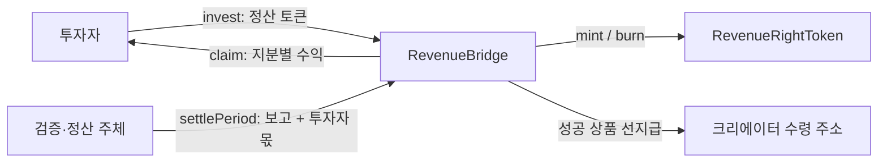
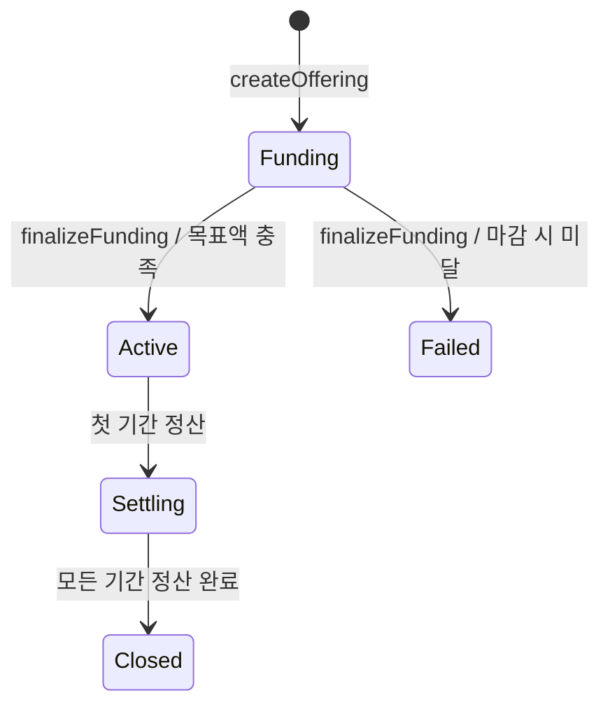

# Creator Revenue Bridge Contracts

이 문서는 [프로젝트 기획과 연구 배경](../README.md)을 스마트 컨트랙트로 구현하기 위한 설계 초안이다. 서비스가 다루는 문제, RWA 구조, 가치평가, 법적·운영적 집행과 연구 가설은 루트 문서에서 관리하고 여기서는 온체인 책임과 구현 방법을 다룬다.

> 상태: 펀딩과 기간별 정산·청구 MVP 핵심 구현 완료, 보안 검증 진행 중. 배포 전 ABI와 운영 권한은 변경될 수 있다.

## 1. 온체인 구현 범위

컨트랙트는 외부에서 결정된 상품 조건을 고정하고, 그 조건에 따른 자금과 수익권의 변화를 처리한다.

| 기획 요구 | 컨트랙트 구현 |
| --- | --- |
| 수익권 발행 | 상품마다 ERC-1155 토큰 ID를 만들고 판매 가능한 총수량 고정 |
| 투자금 모집 | 투자자의 정산 토큰을 예치하고 같은 수량의 조건부 수익권 발행 |
| 모집 성공·실패 | 목표액과 마감 시각으로 상태 결정, 성공 시 선지급 또는 실패 시 환불 허용 |
| 상품 조건 보존 | 수익 기간, 분배 비율, 가격과 외부 문서 해시를 등록 후 변경 불가 상태로 저장 |
| 실제 수익 확인 | 권한 있는 검증자의 기간별 보고와 증빙 해시 기록 |
| 상환 집행 | 보고와 투자자 몫의 실제 입금을 한 트랜잭션에서 처리 |
| 수익 분배 | 누적 입금액과 고정 지분을 사용해 투자자별 청구 가능 금액 계산 |
| 추적 가능성 | 상품·투자·정산·청구 상태 변경을 이벤트로 발행 |

컨트랙트가 수행하지 않는 작업은 다음과 같다.

- 플랫폼 API 호출과 크리에이터 계정 소유 확인
- 미래 수익 예측, 위험 평가와 모집 가격 산정
- 수익청구권 계약 체결과 법적 효력 판단
- 플랫폼 정산계좌에서 투자자 몫을 확보하는 작업
- KYC/AML 수행과 허용 주소의 신원 자료 보관
- 외부 문서 해시가 가리키는 자료의 진실성 판단

컨트랙트는 실제 투자자 몫이 입금된 이후의 지급 규칙을 강제한다. 입금 이전의 현금흐름 집행은 [루트 README의 Enforcement 설명](../README.md#enforcement--집행)에 따른 외부 책임이다.

플랫폼이 코인지갑으로 직접 지급한다고 가정하지 않는다. YouTube 등에서 발생한 법정화폐 수익은 통제된 정산계좌로 받고, 백엔드가 입금과 정산 자료를 대조한 뒤 정산 주체가 투자자 몫의 USDC를 준비해 온체인 정산을 실행한다.

```text
플랫폼 법정화폐 지급
→ 통제된 정산계좌 입금 확인
→ 수익 자료 검증과 투자자 몫 산정
→ 정산 주체의 USDC 준비
→ settlePeriod 보고와 USDC 입금
→ 투자자 claim
```

은행 입금 감지, 법정화폐의 USDC 전환과 트랜잭션 제출은 API와 운영 지갑을 이용해 자동화할 수 있다. 예를 들어 Google은 AdSense for YouTube 지급 수단으로 은행계좌를 받고, 기관용 Circle Mint는 연결된 은행계좌의 법정화폐를 USDC로 전환해 Base 등 지원 체인으로 전송하는 API를 제공한다. 다만 실제 제공자 사용은 국가, 법인 심사와 규제 요건에 달려 있으며, 플랫폼 지급계좌를 통제된 계좌로 지정하는 계약·수탁 구조와 은행 구간의 집행은 스마트 컨트랙트 밖의 책임이다. [YouTube 지급 수단](https://support.google.com/youtube/answer/1714397) · [Circle Mint](https://developers.circle.com/circle-mint) · [Circle 지원 체인](https://developers.circle.com/circle-mint/supported-chains-and-currencies)

## 2. MVP 구현 가정

상품 정의는 [루트 README의 MVP 상품 가정](../README.md#mvp-상품-가정)을 기준으로 한다. 구현에 직접 영향을 주는 가정은 다음과 같다.

- 상품 하나는 특정 크리에이터·플랫폼 계정·수익 기간에 대응한다.
- 투자자는 실제 적격 수익 중 약정 비율을 지분에 따라 받는다.
- 목표액 전액을 모집해야 성공하며 미달 상품은 전액 환불한다.
- 성공 상품에 원금 반환이나 고정 이자, 수익 상한을 별도로 적용하지 않는다.
- 상품마다 고정 단가와 고정 총수량을 사용한다.
- 하나의 배포에서는 단일 ERC-20 정산 자산만 사용한다.
- 수익권은 모집 과정의 발행과 실패 환불의 소각만 허용하고 투자자 간 전송은 막는다.
- 정산 기간은 등록할 때 확정하며, 보고는 기간 순서대로 한 번씩 처리한다.

전송을 허용하면 이미 발생한 수익의 귀속을 별도로 계산해야 한다. MVP는 성공 후 보유량을 고정해 현재 잔액만으로 누적 배분액을 계산한다.

## 3. 컨트랙트 구성

운영 컨트랙트 두 개와 개발용 토큰 하나로 시작한다.

| 컨트랙트 | 책임 |
| --- | --- |
| `RevenueBridge` | 상품 등록, 모집, 확정, 예치금 회계, 선지급, 환불, 기간별 수익 정산과 청구 |
| `RevenueRightToken` | ERC-1155 기반 상품별 지분 잔액과 총공급량 기록, Bridge를 통한 발행·소각 |
| `MockSettlementToken` | 로컬 및 테스트넷에서 사용할 6자리 소수점 모의 결제 자산 |



`RevenueBridge` 배포 시 정산 토큰 주소와 관리자 주소를 고정한다. Bridge가 `RevenueRightToken`을 생성하고 변경 불가능한 controller가 되는 구성을 제안한다. 관리자도 Bridge의 정해진 투자·환불 흐름 밖에서 수익권을 임의 발행하거나 소각할 수 없다.

ERC-1155를 사용하면 하나의 컨트랙트에서 여러 상품을 `tokenId = offeringId`로 표현할 수 있다. 각 ID의 토큰은 해당 상품의 동등한 지분 단위다. MVP에서는 표준의 단일·일괄 전송을 제한하며 operator 승인도 이 제한을 우회하지 못하게 한다. [ERC-1155 표준](https://eips.ethereum.org/EIPS/eip-1155)

프록시와 상품별 Factory는 첫 구현에 포함하지 않는다. 여러 상품이 하나의 Bridge를 공유하므로 상품별 회계는 분리하지만 배포 단위의 코드 위험은 공유한다.

## 4. 역할과 권한

| 주체 | 가능한 작업 | 금지되는 작업 |
| --- | --- | --- |
| `ADMIN` | 역할 관리, 신규 투자 허용 주소 관리, 신규 등록·투자 일시중지 | 기존 상품 조건 변경, 예치 자산 임의 인출, 지분 임의 조정 |
| `ISSUER` | 검토된 조건으로 상품 등록 | 등록된 조건 덮어쓰기 |
| `SETTLER` | 종료된 기간의 수익 보고와 투자자 몫 입금 | 보고만으로 청구 가능 잔액 생성 |
| 크리에이터 | 성공 상품의 선지급금 청구 | 등록된 수령 주소 변경, 반복 청구 |
| 투자자 | 허용 주소로 투자, 본인 환불·수익 청구 | 타인 몫 청구, 수익권 전송 |
| 누구나 | 조건이 충족된 모집 확정과 상품 종료 | 상품 조건이나 정산 수치 지정 |

역할은 OpenZeppelin `AccessControl` 계열을 후보로 둔다. 운영 배포에서는 관리자 주소로 멀티시그를 검토한다. [OpenZeppelin 접근 제어 문서](https://docs.openzeppelin.com/contracts/5.x/access-control)

허용 목록은 신규 투자만 통제한다. 목록에서 제외된 기존 투자자도 실패 환불과 발생한 수익 청구를 계속할 수 있어야 한다. 일시중지도 신규 상품 등록과 투자에만 적용하고 기존 자금의 확정·선지급·환불·정산·청구를 막지 않는다.

## 5. 상품 상태와 데이터



`Settling`은 Active 상품의 첫 기간 정산이 등록되면 저장되는 상태다. 블록 시간이 지났다고 정산 트랜잭션이 자동 실행되지는 않는다. 종료된 다음 기간이 아직 등록되지 않았다면 조회 함수가 연체 여부를 계산하고, `Closed`는 모든 기간의 정산 완료를 확인하는 별도 호출로 저장한다.

상품 등록 시 다음 값을 고정한다.

| 필드 | 의미 |
| --- | --- |
| `offeringId` | 재사용하지 않는 순차 상품 ID |
| `creatorPayout` | 선지급금 수령 주소 |
| `assetKey` | 외부 자산 등록부의 플랫폼·계정 식별값 해시 |
| `termsHash` | 기간·수익 정의·권리 조건을 담은 문서 해시 |
| `valuationHash` | 평가 결과와 평가 모델 버전의 문서 해시 |
| `unitsForSale` | 판매할 총 지분 수량 |
| `unitPrice` | 지분 한 단위당 정산 토큰 금액 |
| `fundingDeadline` | 신규 투자를 받는 마지막 시각 |
| `revenueStart`, `revenueEnd` | 적격 수익 발생 기간의 시작과 종료 |
| `periodEnds` | 사전 확정된 정산 구간의 종료 시각 배열 |
| `revenueShareBps` | 실제 적격 수익 중 투자자 전체 몫, 1~10,000 bps |

등록 시 다음 조건을 검증한다.

- `현재 시각 < fundingDeadline < revenueStart < revenueEnd`
- 크리에이터 수령 주소와 정산 토큰 주소가 0 주소가 아님
- 총수량·단가가 양수이며 `unitsForSale × unitPrice` 계산 가능
- 정산 구간이 수익 기간을 빈틈과 중복 없이 덮고 마지막 경계가 `revenueEnd`와 일치
- 정산 구간 수가 정한 최대치 이하이고 분배 비율이 유효 범위 안에 존재
- 문서 및 평가 해시가 빈 값이 아님

모든 시각은 UTC Unix timestamp를 사용하고 기간은 `[start, end)`로 해석한다. 정산 기간은 돈이 입금된 시각이 아니라 수익이 발생한 기간이다. 지연 입금도 원래 수익 구간으로 보고한다.

## 6. 모집과 선지급

`targetRaise`는 별도 입력값으로 받지 않고 `unitsForSale × unitPrice`로 계산한다.

1. ISSUER가 조건을 등록하면 Funding 상태가 시작된다.
2. 마감 전 허용된 투자자가 양수의 지분 수량과 `units × unitPrice`를 입금한다.
3. 실제 ERC-20 수령액이 계산액과 정확히 일치하면 같은 지분 수량을 투자자에게 발행한다.
4. 남은 판매 수량을 넘는 투자는 revert하며 자동으로 수량을 줄이지 않는다.
5. 목표액을 채우면 마감 전이라도 누구나 성공 확정할 수 있다.
6. 마감 시각부터 신규 투자를 막고, 목표 미달이면 누구나 실패 확정할 수 있다.
7. 성공 후 고정된 크리에이터 수령 주소가 목표액을 한 번 청구한다.
8. 실패 후 각 투자자가 납입금을 한 번 환불받고 조건부 지분을 전량 소각한다.

목표액을 이미 채웠다면 확정 호출이 마감 뒤로 늦어져도 성공으로 처리한다. Active 상태에는 일반 환불 기능을 두지 않는다. 실제 수익 저조는 모집 실패와 다른 상태다.

## 7. 기간별 정산

제안 인터페이스는 `settlePeriod(offeringId, periodIndex, grossRevenue, evidenceHash)`다. `grossRevenue`는 외부에서 계약 기준에 따라 검증하고 정산 토큰 단위로 환산한 적격 수익이다.

- 종료된 구간만 순서대로 처리하고 `(offeringId, periodIndex)`를 한 번만 확정한다.
- 수익이 0인 구간도 증빙 해시가 포함된 0 수익 보고로 확정한다.
- 누적 적격 수익에 분배 비율을 적용해 이번에 추가할 투자자 몫을 계산한다.
- SETTLER로부터 계산된 금액을 `transferFrom`으로 받고 실제 잔액 증가를 확인한다.
- 보고 기록, 회계 갱신과 입금 중 하나라도 실패하면 트랜잭션 전체를 되돌린다.

```text
newGrossTotal = grossTotal + grossRevenue
newInvestorTotal = floor(newGrossTotal × revenueShareBps / 10_000)
depositRequired = newInvestorTotal - investorTotal
```

매 기간을 따로 반올림할 때 생기는 누적 오차를 줄이기 위해 누적 수익으로 계산한다. 곱셈과 나눗셈에는 충분한 정밀도의 `mulDiv` 사용을 검토한다.

컨트랙트는 플랫폼 수익 전체가 아니라 투자자 몫만 받는다. 일반 ERC-20 전송으로 들어온 금액은 정산 보고와 연결되지 않았으므로 투자자의 청구 가능 금액을 늘리지 않는다.

MVP는 확정된 보고의 수정, 음수 조정과 차지백을 지원하지 않는다. 과대 보고 후 지급된 금액을 회수할 수도 없다. 모든 기간 보고가 끝나지 않으면 상품을 종료할 수 없다.

## 8. 투자자별 수익 청구

성공한 상품은 총공급량과 보유량이 고정되므로 누적 입금액을 현재 지분으로 나눈다.

```text
entitled(account) = floor(investorTotal × balanceOf(account, offeringId) / unitsForSale)
claimable(account) = entitled(account) - claimed[offeringId][account]
```

`investorTotal`은 실제 정산 입금 누계이며 청구할 때 감소시키지 않는다. `claimed`와 상품의 `totalClaimed`를 먼저 갱신하고 정산 토큰을 송금한다. 송금이 실패하면 상태 변경도 되돌린다.

누적 방식은 여러 번 나눠 청구한 결과가 마지막에 한 번 청구한 결과와 같도록 한다. 정수 나눗셈 때문에 마지막까지 남는 최소 단위 잔액은 잠근 상태로 두며 관리자 회수 기능은 MVP에 추가하지 않는다.

## 9. 회계 불변조건

상품별 보관 의무 금액은 다음과 같다.

```text
escrowRemaining = raised - advanceWithdrawn - refunded
revenueRemaining = investorTotal - totalClaimed
liability = escrowRemaining + revenueRemaining

Bridge 실제 정산 토큰 잔액 >= 모든 상품 liability 합계
```

구현과 테스트에서 다음 조건을 항상 확인한다.

- `raised <= targetRaise`
- 성공 확정 후 발행량과 투자자별 잔액 불변
- `advanceWithdrawn + refunded <= raised`
- 한 상품의 지급에 다른 상품의 회계 잔액 사용 금지
- `totalClaimed <= investorTotal`
- 투자자별 `claimed <= entitled`
- 정산 보고 없이 청구 가능 금액 증가 금지
- 직접 송금된 초과 잔액의 자동 분배 및 다른 상품 부족분 충당 금지
- 환불·선지급·청구의 반복 실행 금지

수익권 상품은 실제 성과에 따라 원금보다 많은 수익을 지급할 수 있다. 따라서 원금이 아니라 실제 입금액에 따른 본인 배분액을 청구 한도로 사용한다.

## 10. 예상 인터페이스와 이벤트

함수명은 구현 전 제안이다.

| 함수 | 용도 |
| --- | --- |
| `createOffering(terms)` | 조건 검증과 고정 후 상품 등록 |
| `invest(offeringId, units)` | 투자금 예치와 조건부 지분 발행 |
| `finalizeFunding(offeringId)` | 목표액·마감 조건에 따라 성공 또는 실패 확정 |
| `withdrawAdvance(offeringId)` | 크리에이터의 선지급금 청구 |
| `refund(offeringId)` | 실패 상품 투자금 환불과 지분 소각 |
| `settlePeriod(offeringId, periodIndex, grossRevenue, evidenceHash)` | 기간 보고와 투자자 몫 입금 |
| `claim(offeringId)` | 호출자의 미청구 누적 수익 지급 |
| `closeOffering(offeringId)` | 모든 기간 정산 후 Closed 전환 |
| `getOffering`, `statusOf` | 상품 조건과 현재 상태 조회 |
| `claimable`, `refundable`, `nextUnsettledPeriod` | 사용자 및 정산 작업 조회 |

제안 이벤트는 다음과 같다.

- `OfferingCreated`
- `Invested`
- `FundingFinalized`
- `AdvanceWithdrawn`
- `Refunded`
- `PeriodSettled`
- `RevenueClaimed`
- `OfferingClosed`

모든 업무 이벤트에 `offeringId`를 포함한다. 정산 이벤트에는 구간 ID, 증빙 해시, 보고 수익, 실제 입금액과 누적 투자자 몫을 포함해 외부 인덱서가 상태 변화의 근거를 재구성할 수 있게 한다.

## 11. 보안 구현 기준

- ERC-20 이동은 `SafeERC20`을 사용하고 호출 전후 잔액 차이도 확인한다. 수수료 차감형과 리베이스형 토큰은 지원하지 않는다. [OpenZeppelin ERC-20 API](https://docs.openzeppelin.com/contracts/5.x/api/token/erc20)
- 자금과 지분을 바꾸는 외부 함수에 재진입 방어와 상태 변경 후 외부 호출 원칙을 적용한다.
- ERC-1155 mint의 receiver callback도 외부 호출로 취급한다. callback이 실패하면 투자금 이동과 지분 발행이 함께 취소되어야 한다. [OpenZeppelin ERC-1155 API](https://docs.openzeppelin.com/contracts/5.x/api/token/erc1155)
- 투자자 배열을 순회해 일괄 지급하지 않고 각 사용자가 직접 청구하도록 한다.
- 지급 주소는 등록된 크리에이터 주소 또는 직접 청구한 투자자 주소로 고정한다.
- 관리자는 이미 등록된 가격·기간·분배 비율을 바꾸거나 보관 자산을 임의 회수할 수 없다.
- 정산 토큰 전송이 실패하면 청구와 환불을 완료로 기록하지 않는다.
- 프록시 없이 시작하며 새 버전 배포가 기존 상품과 잔액을 자동 이전한다고 가정하지 않는다.

## 12. 백엔드 연동

백엔드는 컨트랙트 이벤트를 읽어 조회용 상태를 구성한다. `(chainId, contractAddress, transactionHash, logIndex)` 조합으로 이벤트를 중복 제거하고 블록 번호와 블록 해시를 함께 저장한다.

트랜잭션 제출, L2 포함과 최종 확정을 서로 다른 상태로 관리한다. 체인 재조직이 발생하면 블록 해시를 기준으로 이벤트를 취소하고 재처리할 수 있어야 한다. 필요한 확정 기준은 배포 L2를 결정할 때 정한다.

백엔드는 수익 평가와 검증 자료를 관리하지만 컨트랙트 상태를 임의로 덮어쓰지 않는다. 상품 생성과 기간 정산 트랜잭션이 확정된 뒤 이벤트를 기준으로 로컬 상태를 갱신한다.

## 13. 테스트 계획

| 테스트 | 검증 내용 |
| --- | --- |
| 정상 흐름 | 등록 → 투자 → 성공 → 선지급 → 복수 기간 정산 → 청구 → 종료 후 잔여 청구 |
| 모집 경계 | 마감 직전·정각, 목표액 정확히 충족·초과, 지연 확정, 실패 후 반복 환불 차단 |
| 조건 고정 | 등록 후 변경 차단, 성공 후 추가 발행·소각·단일/일괄 전송 차단 |
| 정산 실패 | 미종료·잘못된·중복 구간, 잘못된 순서, 권한 없음, allowance·잔액 부족 |
| 수익 변동 | 0 수익, 예상 미달, 원금 초과 수익, 지연 입금, 누락 보고 시 종료 차단 |
| 청구 계산 | 복수 투자자, 반복·일괄 청구 결과 일치, 정수 절삭, 중복 지급 차단 |
| 공격적 수신자 | ERC-1155 callback과 토큰 송금 재진입, receiver 거부, 원자적 롤백 |
| 회계 불변조건 | 상품별·전체 지급 한도, 교차 상품 침범 차단, 직접 송금의 권리 미반영 |
| 역할·일시중지 | 신규 투자 제한과 기존 환불·청구 유지, 관리자 임의 인출 차단 |

단위 테스트 이후 금액, 지분과 호출 순서에 대한 fuzz 및 invariant 테스트를 추가한다. 상태별 유효·무효 호출을 섞어도 `totalClaimed <= investorTotal`과 전체 보관 의무 금액이 유지되는지 확인한다.

## 14. 구현 순서

1. [x] 루트 README의 MVP 상품 조건 정의
2. [x] `OfferingTerms`, 상태 enum, 사용자 정의 오류와 이벤트 정의
3. [x] `MockSettlementToken`과 전송 제한 `RevenueRightToken` 구현
4. [x] 모집·확정·선지급·환불 흐름과 단위 테스트 구현
5. [x] 기간별 정산·누적 청구·종료 흐름 구현
6. [x] 다중 상품 회계 invariant와 주요 공격 시나리오 테스트 추가
7. [x] Anvil 배포 완료 후 전체 수명주기 시나리오 재현
8. [ ] Base Sepolia 배포 스크립트와 백엔드 이벤트 연동

상세 발견 사항과 잔여 위험은 [컨트랙트 보안 검증 기록](../docs/contract-security-review.md)에서 관리한다.

로컬 Anvil 배포와 역할·잔액·데모 상품 구성은 [DeployLocal.s.sol](script/DeployLocal.s.sol)에서 수행한다. 루트의 `scripts/deploy-local.sh`는 배포 manifest와 ABI를 프론트엔드·백엔드 생성 디렉터리에 동기화한다. `scripts/run-local-happy-path.sh`는 역할별 EOA로 모집부터 종료 후 청구까지 전체 RPC 정상 흐름과 최종 회계 상태를 검증한다.

현재 [foundry.toml](foundry.toml)은 Solidity `0.8.30`과 `src/`, `test/`, `script/` 경로를 지정한다. OpenZeppelin과 forge-std는 호환 버전과 commit을 고정해 설치한다.

```bash
cd contracts
forge --version
forge build
forge test
```

Foundry 설치 방법은 [공식 설치 문서](https://getfoundry.sh/introduction/installation/)를 참고한다.

## 15. 후속 구현 과제

- 수익권 이전을 허용할 때 과거 수익 귀속을 계산하는 인덱스 또는 스냅샷
- 허용 주소 변경과 투자자 계정 복구 절차
- 수익 보고 정정, 음수 조정과 차지백
- 동일한 기초 수익의 기간 중복 및 총 배분 비율 통제
- 보고 서명자와 실제 송금 실행자의 분리
- 상품별 독립 금고와 새 버전으로의 명시적 마이그레이션
- 결제 토큰 변경, 환전·수수료·세금 처리
- 운영 관리자 지연 변경과 비상 상황 처리

이 항목들은 루트 README에 기록된 상품·법적·운영 결정이 구체화될 때 컨트랙트 요구사항으로 전환한다.
