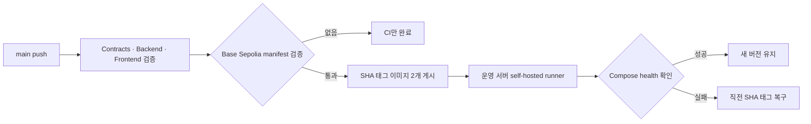

# 운영 배포 가이드

## 배포 구조

`main`에 변경이 들어오면 GitHub Actions가 컨트랙트, 백엔드와 프론트엔드를 병렬로 검증한다. Base Sepolia 배포 manifest인 `contracts/deployments/base-sepolia/84532.json`이 없으면 여기서 종료하며 운영 이미지를 게시하지 않는다.

manifest가 있으면 체인 ID, 네트워크 이름, `pricetext.store` metadata URI, 컨트랙트 주소, 역할 주소와 비밀 필드 부재를 검사한다. 검사를 통과한 뒤 같은 커밋으로 frontend와 backend 이미지를 만들고 다음 이름으로 GHCR에 게시한다.

```text
ghcr.io/baypeline/creator-revenue-bridge-frontend:sha-<commit>
ghcr.io/baypeline/creator-revenue-bridge-backend:sha-<commit>
```

게시가 끝나면 `production` 라벨이 있는 외부 서버의 GitHub Actions self-hosted runner가 두 이미지를 내려받는다. Compose가 backend를 먼저 교체하고 health 응답을 확인한 뒤 frontend를 교체한다. 새 컨테이너가 제한 시간 안에 healthy가 되지 않으면 배포 스크립트가 직전 SHA 태그로 두 서비스를 복구한다.



## 서버 준비

배포 대상은 Windows x64 PC를 기준으로 한다. frontend와 backend 이미지는 Linux 이미지이므로 Docker Desktop에서 WSL 2 backend와 Linux container 모드를 사용해야 한다. Windows 10 또는 Windows 11에서 다음 명령이 모두 성공하는지 PowerShell에서 확인한다.

```powershell
wsl.exe --status
docker version
docker compose version
docker info --format '{{.OSType}}'
```

마지막 명령은 `linux`를 출력해야 한다. Docker Desktop은 Windows Server 제품군을 지원하지 않으므로 운영 PC가 Windows Server라면 Linux VM을 배포 대상으로 사용하도록 구조를 변경해야 한다.

GitHub 저장소의 `Settings → Actions → Runners`에서 Windows x64 self-hosted runner 등록 토큰을 발급받는다. 관리자 PowerShell에서 제공되는 자동 셋업 스크립트를 실행하면 `C:\actions-runner` 설치, `production` 라벨 구성 및 `C:\ProgramData\CreatorRevenueBridge\.env.production` 환경 파일 초기화가 한 번에 수행된다.

```powershell
# 러너 다운로드, 등록 및 환경 파일 초기화
powershell.exe -ExecutionPolicy Bypass -File .\scripts\setup-production-runner.ps1 `
  -RegistrationToken <GitHub가 일회성으로 발급한 토큰>

# 또는 환경 파일과 디렉터리만 먼저 준비할 경우
powershell.exe -ExecutionPolicy Bypass -File .\scripts\setup-production-runner.ps1 -ConfigureEnvOnly
```

수동으로 러너를 구성하려면 관리자 PowerShell에서 `C:\actions-runner`를 만들고 최신 runner를 이 경로에 설치한다. runner 구성 시 `production` 사용자 정의 라벨을 추가한다.

```powershell
Set-Location C:\actions-runner
.\config.cmd `
  --url https://github.com/baypeline/creator-revenue-bridge `
  --token <GitHub가 일회성으로 발급한 토큰> `
  --labels production
```

구성 질문에서는 runner를 Windows 서비스로 설치하고, Docker Desktop을 실행하는 Windows 계정을 서비스 계정으로 지정한다. Docker Desktop의 WSL 2 컨테이너와 이미지는 Windows 계정 사이에서 공유되지 않으므로 다른 서비스 계정을 사용하면 deploy 작업에서 Docker daemon에 접근하지 못할 수 있다.

Docker Desktop은 해당 Windows 사용자가 로그인한 뒤 실행되는 데스크톱 애플리케이션이다. 재부팅 후 무인 배포가 필요하면 이 계정의 로그인·Docker Desktop 자동 시작 정책을 함께 구성하고, runner 서비스가 배포 전에 `docker version`을 실행할 수 있는지 확인한다.

runner 등록을 마친 뒤 서비스와 Docker 접근을 확인한다.

```powershell
Get-Service 'actions.runner.*'
docker ps
```

저장소에 운영 점검 워크플로가 반영된 뒤 GitHub의 `Actions → Production runner check → Run workflow`에서 `main`을 선택해 실행한다. 이 작업은 이미지를 내려받거나 컨테이너를 교체하지 않고, 실제 runner 서비스 계정에서 Docker daemon 접근, Linux container 모드, 운영 환경 파일과 Compose 설정을 확인한다. `production` 환경에 required reviewer가 있으면 승인 후 실행된다.

환경 파일을 기본 경로가 아닌 곳에 만들었다면 실행 화면의 `environment_file`에 절대 경로를 입력한다. 기본 경로는 `C:\ProgramData\CreatorRevenueBridge\.env.production`이다. 안전을 위해 이 점검 작업은 `main`에서만 실행된다.

GitHub의 `Settings → Environments`에 `production` 환경을 만든다. 실제 반영 전에 사람의 확인을 받으려면 이 환경에 required reviewer를 설정한다. 서버 환경 파일 경로를 기본값과 다르게 쓸 때만 `production` 환경 변수 `DEPLOY_ENV_FILE`을 등록한다.

`main`에는 `Workflow`, `Contracts`, `Backend`, `Frontend` 상태 검사를 필수로 지정하고 직접 push를 제한하는 branch protection을 적용한다. self-hosted runner는 저장소 코드를 Docker 권한으로 실행하므로 신뢰된 `main` 커밋의 deploy 작업만 받도록 현재 워크플로의 분기 조건과 `production` 라벨을 유지한다.

## 운영 환경 파일

서버에서 다음 디렉터리와 파일을 만든다. 저장소의 `deploy/production.env.example`을 복사한 뒤 실제 RPC 주소를 입력한다.

```powershell
$deployDirectory = 'C:\ProgramData\CreatorRevenueBridge'
New-Item -ItemType Directory -Force $deployDirectory
Copy-Item `
  .\deploy\production.env.example `
  "$deployDirectory\.env.production"
notepad "$deployDirectory\.env.production"
```

환경 파일에는 RPC 인증 정보가 들어가므로 runner 계정과 SYSTEM만 읽도록 ACL을 제한한다.

```powershell
$envFile = 'C:\ProgramData\CreatorRevenueBridge\.env.production'
icacls $envFile /inheritance:r
icacls $envFile /grant:r "${env:USERNAME}:(F)" 'SYSTEM:(F)'
```

`WEB3_RPC_URL`에는 외부에 공개하지 않는 인증된 Base Sepolia RPC 주소를 넣는다. `DATABASE_PASSWORD`에는 임의로 생성한 긴 비밀번호를 넣고 저장소나 채팅에 공유하지 않는다. 배포자 개인키는 컨트랙트 배포 때만 개발 PC에서 사용하며 운영 서버와 GitHub Actions에는 저장하지 않는다. 이미지 태그는 GitHub Actions가 매 배포마다 주입하므로 환경 파일에 고정하지 않는다.

PostgreSQL은 외부 포트를 열지 않고 Compose 내부에서만 backend와 통신한다. `database_data` 볼륨에 상품 catalog를 보존하므로 일반적인 이미지 교체나 컨테이너 재생성 후에도 데이터가 유지된다. `docker compose down --volumes`는 운영 DB까지 삭제하므로 운영 서버에서는 실행하지 않는다.

운영 화면의 `데모 초기화`는 Base Sepolia Factory 소유자 지갑을 연결한 경우에만 활성화된다. 버튼을 실행하면 새 테스트 mUSD, Bridge, 수익권 토큰과 초기 상품 세 건이 하나의 트랜잭션에서 생성되고 Factory의 활성 버전이 증가한다. 운영 서버나 GitHub Actions는 배포 개인키를 보관하지 않으며 MetaMask가 트랜잭션 서명을 담당한다. 초기화 전 계약과 거래 기록은 삭제되지 않으므로 이전 주소는 온체인 감사 기록으로 계속 조회할 수 있다.

GHCR 패키지가 private이면 repository의 `GITHUB_TOKEN`이 패키지를 읽을 수 있도록 패키지 설정에서 이 저장소에 접근 권한을 부여한다. 워크플로는 장기 PAT 대신 작업마다 발급되는 `GITHUB_TOKEN`으로 로그인한다.

## 도메인 연결

운영 Compose는 frontend `5386`과 backend `8081`을 Windows의 `127.0.0.1`에만 연다. 서버의 기존 리버스 프록시가 `https://pricetext.store` 요청을 frontend의 `127.0.0.1:5386`으로 전달해야 한다. 브라우저의 백엔드 요청과 수익권 metadata 요청은 모두 frontend 경로를 통하므로 backend의 `8081` 포트를 인터넷에 공개할 필요가 없다.

Nginx를 사용한다면 핵심 upstream 설정은 다음과 같다. 인증서와 HTTP에서 HTTPS로의 전환은 서버의 기존 인증서 정책에 맞춰 구성한다.

```nginx
server {
    listen 443 ssl;
    server_name pricetext.store;

    location / {
        proxy_pass http://127.0.0.1:5386;
        proxy_http_version 1.1;
        proxy_set_header Host $host;
        proxy_set_header X-Forwarded-For $proxy_add_x_forwarded_for;
        proxy_set_header X-Forwarded-Proto $scheme;
    }
}
```

## 최초 배포

최초 운영 배포 전에 Base Sepolia 배포와 manifest 검토가 필요하다.

1. 개발 PC에서 `.env.base-sepolia`를 불러오고 `./scripts/deploy-base-sepolia.sh --check`를 다시 실행한다.
2. 최종 점검 후 `./scripts/deploy-base-sepolia.sh --broadcast`를 실행한다.
3. 생성된 `contracts/deployments/base-sepolia/84532.json`에서 주소와 역할을 확인한다.
4. 초기 데모 상품을 시뮬레이션하고 등록한다.

   ```bash
   ./scripts/seed-base-sepolia-demo-offerings.sh --check
   ./scripts/seed-base-sepolia-demo-offerings.sh --broadcast
   ```

   세 번째 상품은 기본값으로 모집 10분, 수익 시작 대기 1분, 1분 단위 세 차례 정산을 사용한다. `DEMO_INSTANT_FUNDING_SECONDS`, `DEMO_INSTANT_START_DELAY_SECONDS`, `DEMO_INSTANT_PERIOD_SECONDS`로 간격을 조정할 수 있다.
5. manifest와 실제 온체인 일정이 반영된 DB migration을 커밋해 `main`에 반영한다.
6. CI가 검증, GHCR 게시와 운영 서버 배포를 순서대로 수행하는지 Actions 화면에서 확인한다.

실제 배포 전에는 `84532.json`이 없으므로 publish 작업은 성공 상태로 건너뛰고 배포 작업도 실행하지 않는다. CI 전용 `31337.json`은 운영 이미지 생성에 사용되지 않는다.

## 운영 확인과 수동 복구

배포 후 외부와 서버 내부에서 다음 경로를 확인한다.

```powershell
curl.exe --fail https://pricetext.store/api/health
curl.exe --fail https://pricetext.store/api/revenue-rights/1.json
curl.exe --fail http://127.0.0.1:8081/api/health
```

현재 실행 이미지와 health 상태는 Docker 명령으로 확인한다.

```powershell
docker ps --filter label=com.docker.compose.project=creator-revenue-bridge
docker inspect --format '{{.Config.Image}} {{.State.Health.Status}}' `
  creator-revenue-bridge-frontend-1 `
  creator-revenue-bridge-backend-1
```

자동 복구 이후에도 문제가 남거나 과거 버전으로 직접 되돌려야 하면 서버의 checkout에서 이전 SHA 태그를 지정한다.

```powershell
.\scripts\deploy-production.ps1 `
  -Tag sha-<되돌릴-40자리-커밋> `
  -EnvFile C:\ProgramData\CreatorRevenueBridge\.env.production
```

또는 현재 로컬 커밋이나 특정 태그를 바탕으로 GHCR 이미지를 즉시 가져와 배포하려면 `pull-and-deploy.ps1` 헬퍼를 사용한다.

```powershell
# 현재 git HEAD 커밋의 SHA 태그로 자동 배포
powershell.exe -ExecutionPolicy Bypass -File .\scripts\pull-and-deploy.ps1

# 특정 이미지 태그 지정 배포
powershell.exe -ExecutionPolicy Bypass -File .\scripts\pull-and-deploy.ps1 -Tag sha-<40자리-커밋>
```

첫 배포에는 이전 이미지가 없으므로 자동 복구할 대상도 없다. 배포 스크립트는 사용 중인 이전 이미지를 자동 삭제하지 않으며, 안정화 확인 후 운영자가 사용하지 않는 이미지를 별도로 정리한다.
